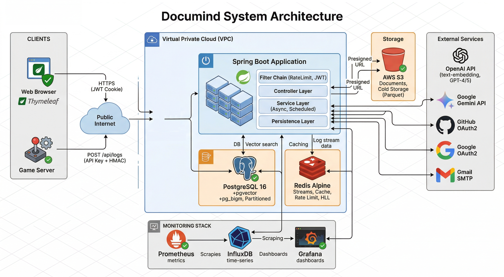
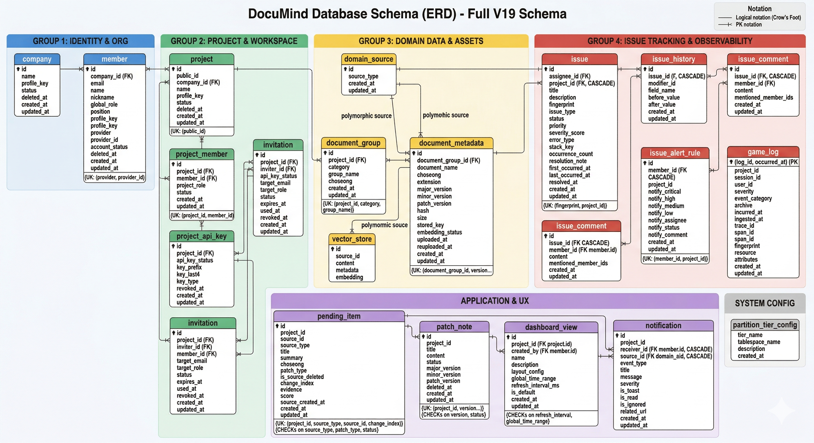
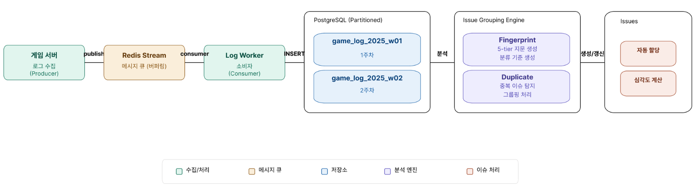
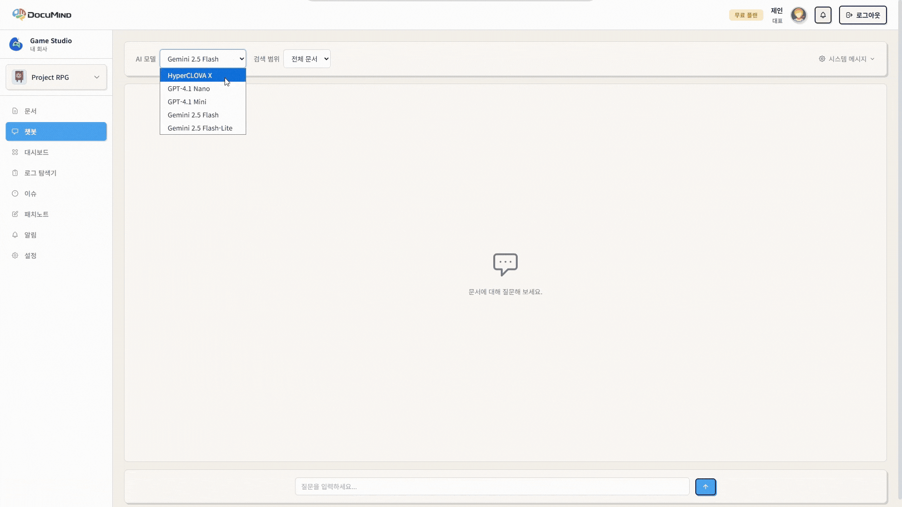
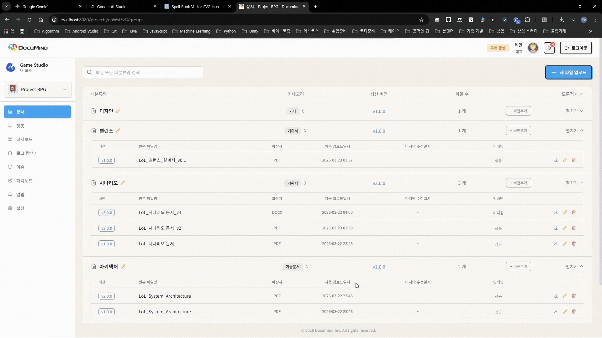
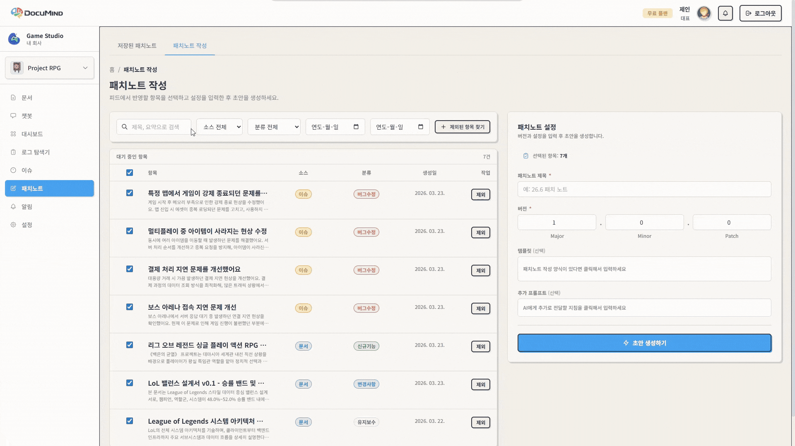
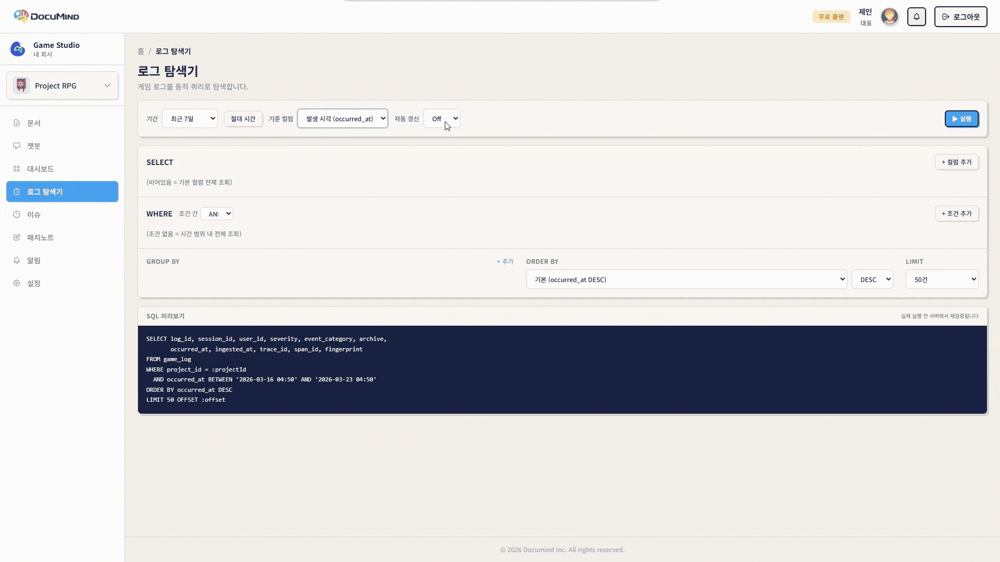
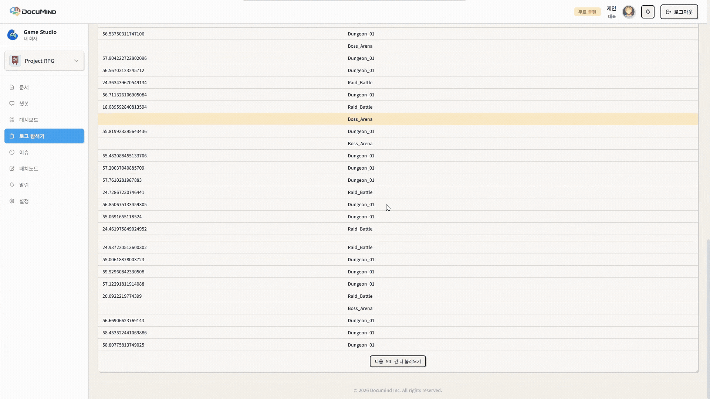

# 📋 DocuMind

<h3 align="center">
게임 서비스의 오류 로그를 실시간으로 수집·분석하고, AI가 이슈를 분류하고 패치노트까지 자동 생성하는 품질 관리 코파일럿
</h3>
<br />
<p align="center">
[대문이미지 — DocuMind 메인 대시보드 화면 캡처](./docs/mainpage.png)
</p>


<p align="center">
  <a href="[Figma링크]">
    
  </a>
  &nbsp;
  <a href="[Notion링크]">
    
  </a>
</p>

---

<a id="프로젝트-소개"></a>
## 📝 프로젝트 소개

**DocuMind**는 게임 운영팀의 품질 관리 업무를 획기적으로 개선하는
**AI 기반 로그 분석 & 이슈 관리 & 문서 검색 플랫폼**입니다.

현재의 게임 운영 환경에서 QA 담당자는 **수천 건의 에러 로그에서 핵심 이슈를 빠르게 파악**하기 어렵습니다.<br>
기존 방식에서는 로그와 이슈의 관계가 명확하지 않아 **중요한 문제를 놓치기 쉽고**,
패치노트는 **수동 작성이 필요해 릴리즈마다 반복적인 비용**이 발생했습니다.

> DocuMind는 이러한 문제를 해결하기 위해, 다음과 같은 기능을 제공합니다:

- 📡 **실시간 로그 수집 파이프라인** — Redis Streams 기반 비동기 수집 + 적응형 배치 처리
- 🔍 **자동 이슈 분류 & 심각도 평가** — SHA-256 핑거프린트 기반 그룹핑 + 5가지 전략 스코어링
- 🤖 **AI 문서 검색 (RAG 챗봇)** — pgvector 벡터 검색 + 멀티 LLM 스트리밍 응답
- 📝 **패치노트 자동 생성** — 해결된 이슈 + 문서 변경 기반 AI 초안 생성
- 🔎 **No-code 로그 탐색기** — SQL 없이 JSON DSL로 로그 검색·집계
- 📊 **커스텀 대시보드** — 드래그 앤 드롭 위젯 레이아웃 + Chart.js 시각화
- 🔔 **실시간 알림** — SSE 기반 토스트 알림 + 딥 링크

## 💡 이런 팀에게 추천해요!

- "수천 건의 에러 로그에서 핵심 이슈를 빠르게 찾고 싶어요"
- "이슈 심각도를 객관적인 기준으로 평가하고 싶어요"
- "프로젝트 문서를 AI에게 질문하며 빠르게 파악하고 싶어요"
- "패치노트 작성을 자동화하고 싶어요"

## 📗 DocuMind와 함께,
**게임 품질 관리의 정확도는 높이고, 시간은 줄이세요.**
운영팀의 반복 업무는 줄이고, 품질은 체계적으로 관리하는 게임 QA의 진짜 코파일럿, **DocuMind** ✨

---

## 📚 목차
- [프로젝트 소개](#프로젝트-소개)
- [시스템 아키텍처](#시스템-아키텍처)
- [ERD](#erd)
- [기술 스택 및 도입 이유](#기술-스택-및-도입-이유)
- [핵심 기능 소개](#핵심-기능-소개)
- [트러블 슈팅](#트러블-슈팅)
- [팀원 구성](#팀원-구성)

---

<a id="시스템-아키텍처"></a>
## 🖼️ 시스템 아키텍처


---

<a id="erd"></a>
## 🧩 ERD


### 테이블 요약

| 테이블 | PK 타입 | 설명 |
|--------|---------|------|
| `company` | BIGSERIAL | 조직 (멀티테넌트) |
| `member` | UUID | OAuth2 연동 사용자 |
| `project` | UUID | 프로젝트 (publicId로 URL 노출) |
| `project_member` | BIGSERIAL | 프로젝트 멤버십 + 역할 |
| `project_api_key` | BIGSERIAL | API 키 (HMAC 해시 저장) |
| `invitation` | UUID | 이메일 초대 (72시간 만료) |
| `domain_source` | BIGSERIAL | 문서 기본 엔티티 |
| `document_group` | BIGSERIAL | 문서 그룹 (카테고리별) |
| `document_metadata` | BIGINT (FK) | 문서 메타데이터 + 버전 |
| `vector_store` | UUID | 벡터 임베딩 (pgvector 1536차원) |
| `game_log` | UUID + TIMESTAMP | 게임 로그 (주별 파티셔닝) |
| `issue` | BIGSERIAL | 이슈 (핑거프린트 기반 그룹핑) |
| `issue_history` | BIGSERIAL | 이슈 변경 이력 |
| `issue_comment` | BIGSERIAL | 이슈 댓글 + 멘션 |
| `issue_alert_rule` | BIGSERIAL | 알림 규칙 설정 |
| `pending_item` | BIGSERIAL | 패치노트 후보 항목 |
| `patch_note` | BIGSERIAL | 패치노트 (시맨틱 버저닝) |
| `dashboard_view` | UUID | 대시보드 위젯 레이아웃 |
| `notification` | BIGSERIAL | 실시간 알림 |

---

<a id="기술-스택-및-도입-이유"></a>
## 🛠 기술 스택 및 도입 이유

### Backend
| Category | Stack | 도입 이유 |
|----------|-------|----------|
| Language |  | 안정적인 타입 시스템과 풍부한 엔터프라이즈 생태계를 활용하기 위해 사용 |
| Framework |  | 자동 설정과 DDD 기반 도메인 분리 구조를 효율적으로 구성하기 위해 사용 |
| ORM |  | 엔티티 매핑과 트랜잭션 관리를 선언적으로 처리하기 위해 사용 |
| Dynamic Query |  | 로그 탐색기의 동적 쿼리를 타입 세이프하게 구성하기 위해 도입 |
| Security |  | OAuth2 소셜 로그인과 역할 기반 접근 제어를 분리하기 위해 도입 |
| Authentication |  | 무상태 인증으로 수평 확장이 가능한 구조를 확보하기 위해 사용 |
| Real-time |  | 서버에서 클라이언트로 단방향 실시간 알림을 전달하기 위해 사용 |
| Validation |  | 요청 DTO의 입력값을 선언적으로 검증하기 위해 사용 |
| API Docs |  | API 명세를 코드 기반으로 자동 생성하여 문서 관리 비용을 줄이기 위해 도입 |
| DB Migration |  | 팀원 간 스키마 변경을 버전 관리하고 자동 마이그레이션하기 위해 사용 |
| Code Format |  | Google Java Format(AOSP) 기반으로 코드 스타일을 자동 통일하기 위해 도입 |

### AI & Document Processing
| Category | Stack | 도입 이유 |
|----------|-------|----------|
| AI Framework |  | RAG 파이프라인과 멀티 LLM 연동을 Spring 생태계 내에서 일관되게 구성하기 위해 도입 |
| LLM |  | 패치노트 생성, 이슈 요약 등 고품질 텍스트 생성을 위해 사용 |
| LLM |  | 대안 LLM으로 비용 최적화와 모델 선택의 유연성을 확보하기 위해 도입 |
| LLM |  | 로컬 LLM(HyperCLOVA X) 실행으로 외부 API 의존도를 줄이기 위해 지원 |
| Embedding |  | 1536차원 벡터 임베딩으로 문서 유사도 검색 정확도를 확보하기 위해 사용 |
| PDF Parsing |  | PDF 문서의 텍스트와 테이블을 정밀하게 추출하기 위해 사용 |
| Office Parsing |  | Word/Excel 문서를 서버에서 직접 파싱하기 위해 사용 |
| Generic Parsing |  | 다양한 파일 형식을 통합 파싱하기 위한 폴백으로 도입 |

### Database & Cache
| Category | Stack | 도입 이유 |
|----------|-------|----------|
| RDBMS |  | 파티셔닝, JSONB, pgvector 등 고급 기능을 활용한 로그/벡터 저장소로 사용 |
| Vector Store |  | HNSW 인덱스 기반 코사인 유사도 검색으로 RAG 벡터 저장소를 구성하기 위해 도입 |
| Full-text Search |  | 한국어 2-gram 기반 전문 검색으로 문서/패치노트 키워드 검색을 지원하기 위해 도입 |
| Cache / Stream |  | 로그 수집 스트리밍(Redis Streams), JWT 세션, Rate Limiting, HyperLogLog를 통합 처리하기 위해 사용 |
| Rate Limiting |  | 로그 수집 API의 요청 속도를 제한하여 시스템 안정성을 확보하기 위해 도입 |
| Resilience |  | Redis Streams 장애 시 Circuit Breaker와 Retry로 시스템 복원력을 확보하기 위해 도입 |

### Infrastructure
| Category | Stack | 도입 이유 |
|----------|-------|----------|
| Container |  | PostgreSQL, Redis 등 인프라를 환경 차이 없이 일관되게 구성하기 위해 사용 |
| Object Storage |  | 문서 파일 저장 및 Cold Storage 아카이빙을 위해 도입 |
| Cold Storage |  | 4주 이상 경과된 로그를 컬럼 기반 압축 포맷으로 S3에 아카이빙하기 위해 사용 |
| S3 Emulation |  | 로컬 개발 환경에서 AWS S3를 에뮬레이션하여 비용 없이 테스트하기 위해 사용 |

### Monitoring & Testing
| Category | Stack | 도입 이유 |
|----------|-------|----------|
| Metrics |  | 애플리케이션 메트릭을 수집하여 성능 이상을 조기에 파악하기 위해 도입 |
| Dashboard |  | 서버 자원과 애플리케이션 상태를 시각적으로 모니터링하기 위해 사용 |
| Metrics DB |  | k6 부하 테스트 결과를 시계열 데이터로 저장·조회하기 위해 사용 |
| Load Testing |  | 로그 수집 API의 성능 한계를 측정하고 병목을 사전에 발견하기 위해 도입 |

### Frontend
| Category | Stack | 도입 이유 |
|----------|-------|----------|
| Template Engine |  | 서버사이드 렌더링으로 초기 로드 속도를 확보하고 Spring Security와 자연스럽게 통합하기 위해 사용 |
| JavaScript | -F7DF1E?style=for-the-badge&logo=javascript&logoColor=black) | 프레임워크 의존 없이 SSE, Fetch API 등 브라우저 네이티브 기능을 활용하기 위해 사용 |
| Charts |  | 대시보드 위젯의 데이터 시각화를 가볍고 유연하게 구현하기 위해 사용 |
| File Upload |  | 드래그 앤 드롭 문서 업로드 UX를 직관적으로 제공하기 위해 도입 |
| Styling |  | 반응형 레이아웃과 UI 컴포넌트를 빠르게 구성하기 위해 사용 |

---

<a id="핵심-기능-소개"></a>
## ✨ 핵심 기능 소개

### 📡 실시간 로그 수집

| 로그 수집 파이프라인                                                                  |
|------------------------------------------------------------------------------|
|  |

- Redis Streams 기반 비동기 수집 + 적응형 배치 처리 (100~1,000건)
- 심각도 기반 샘플링 (DEBUG 5%, INFO 10%, WARN 50%, ERROR/FATAL 100%)
- Dead Letter Queue + 최대 5회 재시도
- Hot/Warm/Cold 3단계 계층형 스토리지 (SSD → HDD → S3 Parquet)

### 🔍 자동 이슈 분류 & 심각도 평가

| 이슈 대시보드                                                            |
|--------------------------------------------------------------------|
|  |

- SHA-256 핑거프린트로 동일 이슈 자동 그룹핑
- 5가지 전략으로 0~100점 심각도 스코어 산출 (빈도/사용자수/비즈니스임팩트/차단정도/크래시유형)
- 이슈 라이프사이클: RECOMMENDED → TODO → IN_PROGRESS → RESOLVED
- 담당자 배정 + 변경 이력(Audit Trail) 자동 추적

### 🤖 AI 문서 검색 (RAG 챗봇)

| RAG 챗봇 대화                                                                   |
|-----------------------------------------------------------------------------|
|  |

- PDF 문서 업로드 → 자동 파싱 → 벡터 임베딩 (OpenAI text-embedding-3-large)
- pgvector HNSW 인덱스 기반 코사인 유사도 검색 (threshold 0.3, top-K 5)
- SSE 스트리밍으로 토큰 단위 실시간 응답
- 멀티 LLM 지원: OpenAI GPT-4.1 / Google Gemini 2.5 / Ollama (HyperCLOVA X)

### 📝 패치노트 자동 생성

| 패치노트 AI 생성                                                      |
|-----------------------------------------------------------------|
|  |

- 해결된 이슈 + 문서 변경 사항 → PendingItem 후보 자동 수집
- RAG 컨텍스트 구성 → AI가 패치노트 초안 스트리밍 생성
- 할루시네이션 참조 자동 제거 (RefValidator)
- 시맨틱 버저닝 (major.minor.patch) + DRAFT → PUBLISHED 워크플로우

### 🔎 로그 탐색기 (No-code SQL)

| 로그 탐색기                                                              |
|---------------------------------------------------------------------|
|  |

- SQL 없이 JSON DSL로 SELECT, WHERE, ORDER BY, GROUP BY 구성
- 집계 함수 지원: COUNT, SUM, AVG, MIN, MAX, DISTINCT
- JSONB 필드 중첩 접근 (`attributes.game.fps`)
- 파라미터 바인딩으로 SQL Injection 완전 차단

### 📊 커스텀 대시보드

| 대시보드 위젯                                                            |
|--------------------------------------------------------------------|
|  |

- 사용자별 위젯 레이아웃 저장 (JSONB)
- 드래그 앤 드롭 배치
- Chart.js 기반 데이터 시각화
- 시간 범위 설정 (15분 ~ 30일)

### 👥 프로젝트 & 조직 관리

| 프로젝트 관리 |
|----------|
| [프로젝트관리이미지 — 프로젝트 설정, 멤버 관리, API Key 발급 화면](./docs/dashboard.png) |

- 멀티테넌트 구조 (Company → Project → Member)
- OAuth2 소셜 로그인 (GitHub, Google)
- 프로젝트 역할 기반 접근 제어 (MANAGER / MEMBER / VIEWER)
- 이메일 초대 (HMAC-SHA256 서명, 72시간 만료)
- API Key 발급·폐기 관리 (해시 저장, prefix + last4 표시)

### 🔔 실시간 알림 (SSE)

- SSE 기반 실시간 토스트 알림
- 이벤트 타입: 이슈 생성, 담당자 배정, 문서 업로드, 패치노트 등
- 읽음/무시/해제 상태 관리 + 관련 리소스 딥 링크
- DB 영속 저장 + SSE 비동기 전송 분리

---

<a id="트러블-슈팅"></a>
## 🛠 트러블 슈팅

### 1. Redis Streams 로그 수집 안정성 확보

**📌 문제 상황**

대량의 게임 로그가 동시에 유입될 때, Redis Streams 소비자가 처리 속도를 따라가지 못해
**메시지 누적(PEL 증가)과 메모리 사용량 급증**이 발생했다.

- 트래픽 피크 시 배치 처리 지연
- DB 응답 시간 증가 시 연쇄적인 처리 실패
- 실패한 메시지의 무한 재시도로 인한 리소스 낭비

**🔍 원인 분석**

1. **고정 배치 크기** — DB 부하와 무관하게 일정량을 처리하려 해서 DB 응답 지연 시 전체가 밀림
2. **재시도 정책 부재** — 실패 메시지가 무한 재시도되며 정상 메시지 처리를 방해
3. **백프레셔 미적용** — 소비자가 자신의 처리 능력을 초과하는 메시지를 계속 수신

**✔️ 해결 방법**

**1️⃣ 적응형 배치 크기 (BackpressureManager)**
```
DB 응답시간 측정
  ↓
latency < 100ms → 배치 크기 증가 (최대 1,000)
latency > 300ms → 배치 크기 감소 (최소 100)
```

**2️⃣ Dead Letter Queue + 최대 재시도**
```
처리 실패 → DLQ 이동 → 5초 간격 재시도 (최대 5회) → 최종 실패 시 ACK 후 로깅
```

**3️⃣ Circuit Breaker (Resilience4j)**
```
최근 10건 중 50% 이상 실패 → OPEN 상태 (10초 대기) → HALF_OPEN → 복구 확인
```

**4️⃣ 심각도 기반 샘플링 (LogSamplingService)**

| 심각도 | 샘플링 비율 | 이유 |
|--------|-----------|------|
| DEBUG | 5% | 디버그 로그는 소량만 보존 |
| INFO | 10% | 정보성 로그 선별 저장 |
| WARN | 50% | 주의 수준 로그 반영 |
| ERROR/FATAL | 100% | 에러는 전수 보존 |

**📊 결과**

| 항목 | 개선 전 | 개선 후 |
|------|--------|--------|
| 피크 시 PEL 크기 | 10,000+ | 100 이하 |
| DB 과부하 시 처리 | 연쇄 실패 | 배치 축소 + 우아한 감속 |
| 실패 메시지 처리 | 무한 재시도 | DLQ 5회 후 정리 |
| 장애 복구 | 수동 재시작 | Circuit Breaker 자동 복구 |

---

### 2. RAG 벡터 검색 정확도 및 성능 최적화

**📌 문제 상황**

문서를 업로드하고 RAG 챗봇으로 질문했을 때,
**관련 없는 청크가 검색되거나 한국어 키워드 검색이 누락**되는 문제가 발생했다.

- 코사인 유사도만으로는 한국어 키워드 매칭이 부정확
- 대량 벡터에서 검색 속도 저하
- 프로젝트 간 벡터 격리가 안 돼 다른 프로젝트 문서가 검색됨

**🔍 원인 분석**

1. **순수 벡터 검색의 한계** — 의미적 유사도는 높지만, 정확한 키워드(기술 용어, 고유명사)를 놓침
2. **인덱스 미적용** — 전체 테이블 스캔으로 벡터 검색 수행
3. **메타데이터 필터 부재** — project_id 기반 격리 없이 전체 벡터에서 검색

**✔️ 해결 방법**

**1️⃣ 하이브리드 검색 (벡터 + pg_bigm 키워드)**
```sql
-- 벡터 유사도 검색
SELECT ... FROM vector_store
WHERE embedding <=> query_embedding < threshold
  AND metadata->>'project_id' = ?

-- pg_bigm 키워드 검색 (한국어 2-gram)
AND content LIKE '%검색어%'  -- GIN 인덱스 활용
```

**2️⃣ HNSW 인덱스 적용**
```sql
CREATE INDEX vector_store_embedding_idx
  ON vector_store USING hnsw (embedding vector_cosine_ops);
```

**3️⃣ 메타데이터 기반 프로젝트 격리**
```sql
CREATE INDEX idx_vector_store_project_id
  ON vector_store ((metadata->>'project_id'));
```

**📊 결과**

| 항목 | 개선 전 | 개선 후 |
|------|--------|--------|
| 한국어 키워드 매칭 | 누락 빈번 | pg_bigm GIN으로 정확 매칭 |
| 벡터 검색 속도 | 전체 스캔 | HNSW 인덱스로 밀리초 단위 |
| 프로젝트 격리 | 미격리 | metadata 필터로 완전 격리 |

---

### 3. 패치노트 AI 생성 시 컨텍스트 초과 및 할루시네이션

**📌 문제 상황**

PendingItem이 많은 프로젝트에서 패치노트를 생성할 때,
**LLM 컨텍스트 윈도우를 초과**하거나
**존재하지 않는 참조를 생성(할루시네이션)**하는 문제가 발생했다.

**🔍 원인 분석**

1. 모든 PendingItem의 evidence(변경 근거)를 그대로 프롬프트에 넣어 토큰 초과
2. LLM이 RAG 컨텍스트에 없는 문서를 참조하여 거짓 인용 생성
3. 생성 중 동일 프로젝트에서 중복 요청 시 경쟁 상태 발생

**✔️ 해결 방법**

**1️⃣ Evidence Reducer (토큰 사용량 제어)**
```
토큰 추정 → 초과 시 evidence 길이 축소 → 재추정
→ SSE로 컨텍스트 축소 비율 알림
```

**2️⃣ RefValidator (할루시네이션 제거)**
```
LLM 출력 파싱 → 참조된 소스 추출
→ RAG 컨텍스트의 실제 소스와 대조
→ 컨텍스트에 없는 참조 자동 제거
```

**3️⃣ 동시 생성 방지 (ConcurrentHashMap Lock)**
```java
if (!activeGenerations.add(projectId)) {
    return Flux.just(sseConverter.errorEvent("이미 생성 중입니다"));
}
// ... 생성 완료 후
doFinally(signal -> activeGenerations.remove(projectId));
```

**📊 결과**

| 항목 | 개선 전 | 개선 후 |
|------|--------|--------|
| 대량 항목 생성 | 토큰 초과 에러 | Evidence 자동 축소 |
| 거짓 참조 | 존재하지 않는 문서 인용 | RefValidator로 자동 제거 |
| 중복 요청 | 경쟁 상태로 중복 생성 | 프로젝트 단위 락 |

---

### ✅ 트러블 슈팅 요약

| 문제 | 핵심 원인 | 해결 전략 |
|------|----------|----------|
| 로그 수집 불안정 | 고정 배치 + 재시도 정책 부재 | 적응형 배치 + DLQ + Circuit Breaker |
| RAG 검색 부정확 | 순수 벡터 검색 한계 | 하이브리드 검색 + HNSW + 프로젝트 격리 |
| 패치노트 할루시네이션 | 컨텍스트 초과 + 참조 미검증 | Evidence Reducer + RefValidator |

